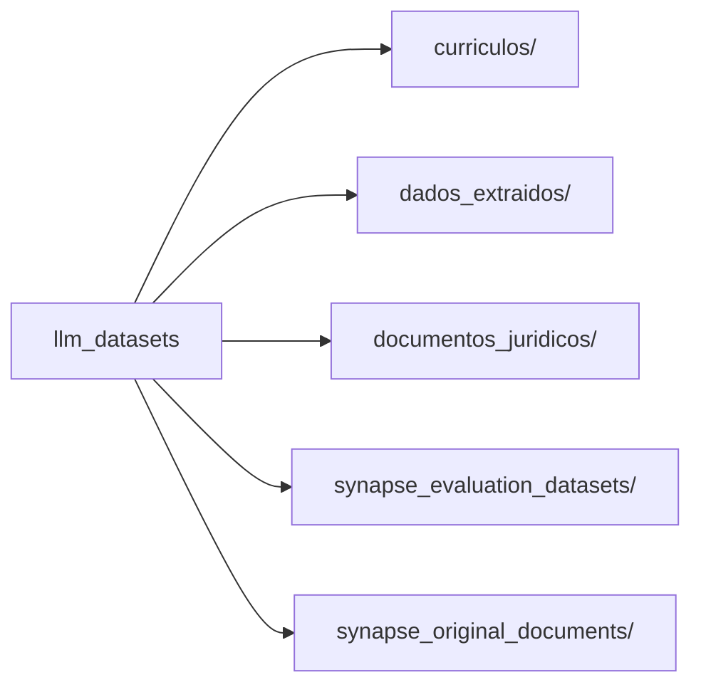

# llm_datasets

## Architecture overview

```mermaid
flowchart LR
    repo["llm_datasets"]
    repo --> d0["curriculos/"]
    repo --> d1["dados_extraidos/"]
    repo --> d2["documentos_juridicos/"]
    repo --> d3["synapse_evaluation_datasets/"]
    repo --> d4["synapse_original_documents/"]
```
